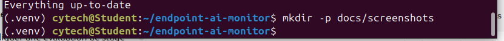
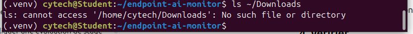

# AI-Powered Endpoint Monitor

A real-time **Endpoint Monitoring & Anomaly Detection Platform** combining Python system telemetry, behavioral feature engineering, Machine Learning, alert management and a Flask dashboard.

The platform monitors Linux processes, analyzes their behavior and uses a trained **Gradient Boosting** model to identify unusual activity.

> Educational and defensive cybersecurity project.  
> No real malware is used.

---

## Dashboard

### Real-Time Monitoring



### Alert History



---

# Quick Start

## 1. Clone the repository

```bash
git clone https://github.com/SaadTr4/endpoint-ai-monitor.git
cd endpoint-ai-monitor
```

## 2. Create a Python virtual environment

```bash
python3 -m venv .venv
```

## 3. Activate it

```bash
source .venv/bin/activate
```

## 4. Install dependencies

```bash
pip install -r requirements.txt
```

## 5. Launch the complete platform

```bash
python -m app.dashboard.app
```

## 6. Open the dashboard

Open:

```text
http://127.0.0.1:5000
```

That's all that is required to run the application.

The pretrained model is already available in:

```text
models/gradient_boosting.joblib
```

---

# What Happens When the Application Starts

Running:

```bash
python -m app.dashboard.app
```

automatically starts:

```text
Linux Endpoint
      ↓
Process Monitoring
      ↓
Runtime Feature Engineering
      ↓
Machine Learning Detection
      ↓
Normal / Suspicious Classification
      ↓
Alert Confirmation
      ↓
CSV / JSON History
      ↓
Real-Time Flask Dashboard
```

The monitoring engine runs in a background Python thread while Flask serves the dashboard.

---

# Main Features

- Real-time Linux process monitoring
- CPU and memory monitoring
- Thread monitoring
- Network connection monitoring
- Process age tracking
- Behavioral feature engineering
- Machine Learning anomaly detection
- Suspicious probability score
- Temporal alert confirmation
- Alert cooldown / anti-spam mechanism
- CSV and JSON alert history
- Real-time CPU and RAM charts
- Live suspicious-process table
- Flask web dashboard

---

# Machine Learning Features

The current model uses:

```text
cpu_percent
memory_mb
num_threads
connections
process_age_seconds
cpu_change_rate
memory_change_rate
threads_change
connections_change_rate
```

The objective is not only to analyze the current state of a process, but also its behavior over time.

Example:

```text
CPU at t1 = 10%
CPU at t2 = 60%

CPU change = +50
Time delta = 2.5 seconds

CPU change rate = 20 points / second
```

---

# Detection Logic

The Machine Learning model outputs a suspicious score.

Example:

```text
Process: chrome
Suspicious score: 0.9626
Classification: Suspicious
```

A single suspicious prediction does not immediately create an alert.

The platform requires:

```text
3 consecutive Suspicious detections
```

Example:

```text
Cycle 1 → Suspicious
Cycle 2 → Suspicious
Cycle 3 → Suspicious

=> Confirmed Alert
```

If the process becomes normal again:

```text
Cycle 1 → Suspicious
Cycle 2 → Normal

=> Detection counter reset
```

This mechanism helps reduce temporary false positives.

---

# Machine Learning Models

Three supervised models were evaluated:

- Logistic Regression
- Random Forest
- Gradient Boosting

## Evaluation Results

| Model | Accuracy | Precision | Recall | F1-score |
|---|---:|---:|---:|---:|
| Logistic Regression | 97.13% | 99.19% | 95.03% | 97.07% |
| Random Forest | 99.26% | 98.77% | 99.77% | 99.27% |
| Gradient Boosting | 99.30% | 98.77% | 99.84% | 99.31% |

Gradient Boosting is used by the real-time Detection Engine.

---

# Scenario-Based Evaluation

Synthetic suspicious behaviors were divided into several controlled scenarios.

| Scenario | Gradient Boosting Recall |
|---|---:|
| CPU Spike | 99.61% |
| Memory Growth | 100% |
| Thread Burst | 100% |
| Network Burst | 100% |
| Mixed Anomaly | 99.61% |

These metrics refer to the controlled synthetic dataset and should not be interpreted as real-world malware detection performance.

---

# Synthetic Detection Scenarios

No malware is executed.

Suspicious training observations are generated using controlled behavioral modifications:

```text
CPU Spike
Memory Growth
Thread Burst
Network Burst
Mixed Behavioral Anomaly
```

The project therefore focuses on **behavioral anomaly detection**, not malware signature detection.

---

# Full ML Pipeline

The pretrained model is sufficient for normal execution.

The following commands are only required to reproduce the entire Machine Learning pipeline.

## 1. Collect endpoint telemetry

```bash
python main.py
```

Stop the collection with:

```text
Ctrl + C
```

Raw telemetry is stored in:

```text
data/raw/process_monitoring.csv
```

## 2. Explore the collected data

```bash
python app/analysis/explore_data.py
```

## 3. Build behavioral features

```bash
python app/features/build_features.py
```

## 4. Analyze feature quality

```bash
python app/analysis/analyze_features.py
```

## 5. Compare user and system processes

```bash
python app/analysis/compare_users.py
```

## 6. Build the ML train/test datasets

```bash
python app/ml/build_dataset.py
```

Generated datasets:

```text
data/processed/ml_train.csv
data/processed/ml_test.csv
```

## 7. Train and compare models

```bash
python app/ml/train_models.py
```

## 8. Evaluate models by behavioral scenario

```bash
python app/ml/evaluate_scenarios.py
```

## 9. Train and save the production model

```bash
python app/ml/save_model.py
```

The resulting model is stored in:

```text
models/gradient_boosting.joblib
```

---

# Terminal-Only Monitoring

The detection system can also run without the Flask dashboard:

```bash
python -m app.detection.realtime_monitor
```

Stop with:

```text
Ctrl + C
```

---

# Alert Storage

Confirmed alerts are stored in:

```text
data/alerts/alerts.csv
data/alerts/alerts.json
```

An alert contains information such as:

```text
Timestamp
PID
Process
Username
CPU usage
Memory usage
Network connections
ML score
Consecutive detections
```

Runtime alert files are intentionally excluded from Git.

---

# Project Architecture

```text
endpoint-ai-monitor/
│
├── app/
│   │
│   ├── analysis/
│   │   ├── analyze_features.py
│   │   ├── compare_users.py
│   │   └── explore_data.py
│   │
│   ├── dashboard/
│   │   ├── app.py
│   │   ├── runtime_service.py
│   │   └── templates/
│   │       └── index.html
│   │
│   ├── detection/
│   │   ├── alert_manager.py
│   │   ├── alert_writer.py
│   │   ├── engine.py
│   │   └── realtime_monitor.py
│   │
│   ├── features/
│   │   ├── build_features.py
│   │   └── runtime_features.py
│   │
│   ├── ml/
│   │   ├── build_dataset.py
│   │   ├── evaluate_scenarios.py
│   │   ├── save_model.py
│   │   └── train_models.py
│   │
│   ├── monitor/
│   │   └── collector.py
│   │
│   └── storage/
│       └── writer.py
│
├── docs/
│   └── screenshots/
│       ├── dashboard-overview.png
│       └── dashboard-alert-history.png
│
├── models/
│   └── gradient_boosting.joblib
│
├── main.py
├── requirements.txt
├── .gitignore
└── README.md
```

---

# Technologies

- Python 3.12
- psutil
- pandas
- NumPy
- scikit-learn
- Gradient Boosting
- joblib
- Flask
- Python threading
- HTML / CSS / JavaScript
- Chart.js
- CSV / JSON
- Linux

---

# Privacy

The monitor does not intentionally collect:

- passwords
- keystrokes
- file contents
- browser history
- API keys
- environment variables

Raw endpoint telemetry and runtime alerts are excluded from Git through `.gitignore`.

---

# Limitations

This project is an educational prototype.

Current limitations include:

- suspicious training data is synthetic,
- no real malware dataset,
- no file scanning,
- no signature detection,
- no kernel-level telemetry,
- Linux-focused implementation,
- model trained using data from a limited local environment,
- legitimate resource spikes may generate false positives.

Therefore:

> `Suspicious` means that the observed behavior resembles patterns learned from the controlled synthetic anomaly dataset.

It does not mean that malware has been confirmed.

---

# Future Improvements

Potential improvements include:

- Isolation Forest
- One-Class SVM
- SHAP model explainability
- longer normal-behavior baselines
- cross-machine validation
- SQLite/PostgreSQL alert storage
- webhook/email notifications
- dashboard authentication
- configurable detection thresholds
- Docker deployment
- automated unit and integration tests

---

# Disclaimer

This project is intended exclusively for educational, defensive and authorized use.

It is not a replacement for a production EDR, antivirus, SIEM or incident response platform.
